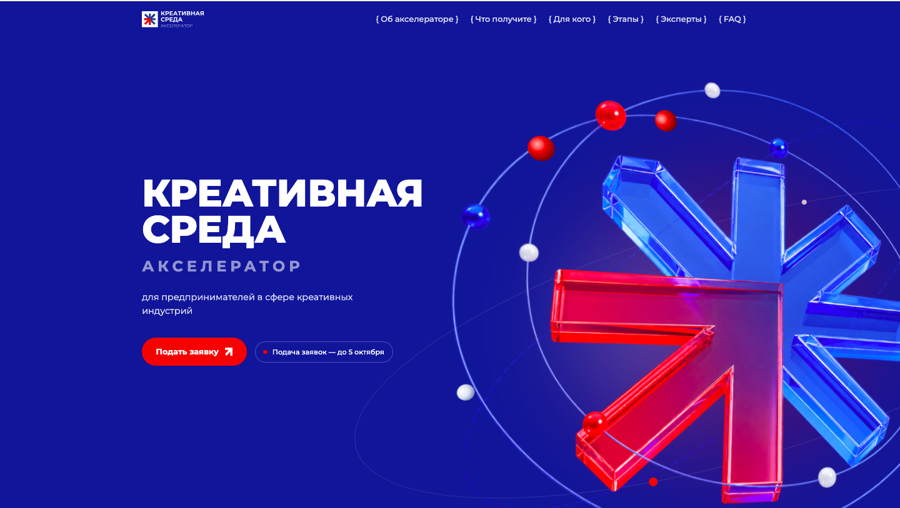
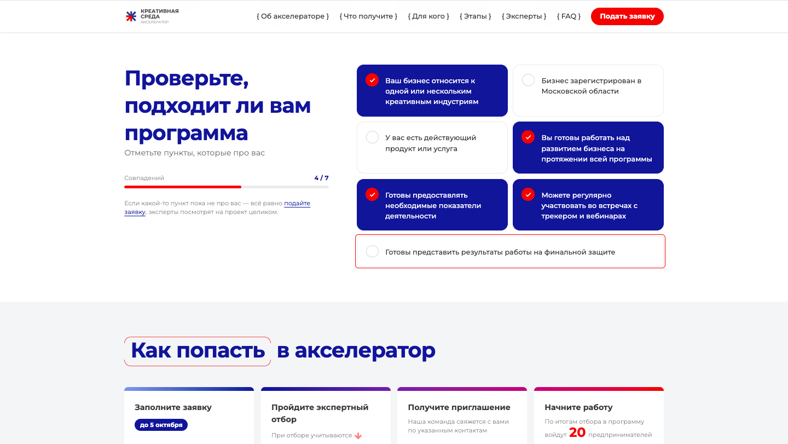
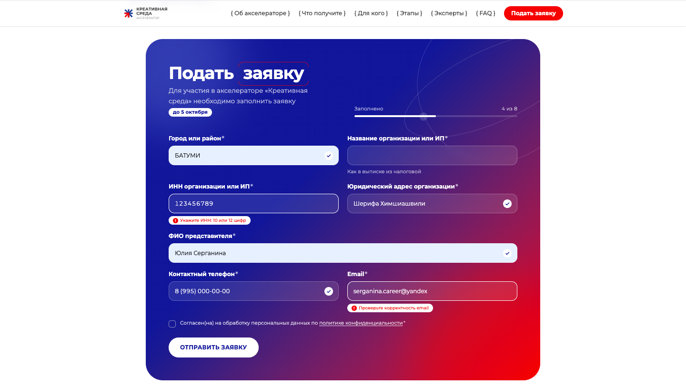
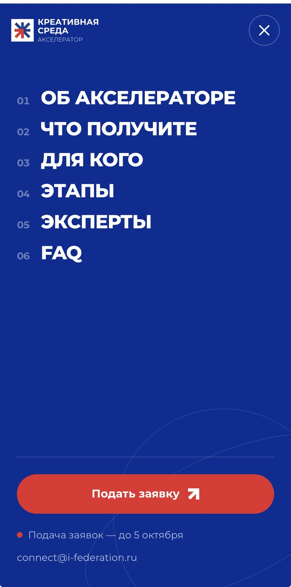
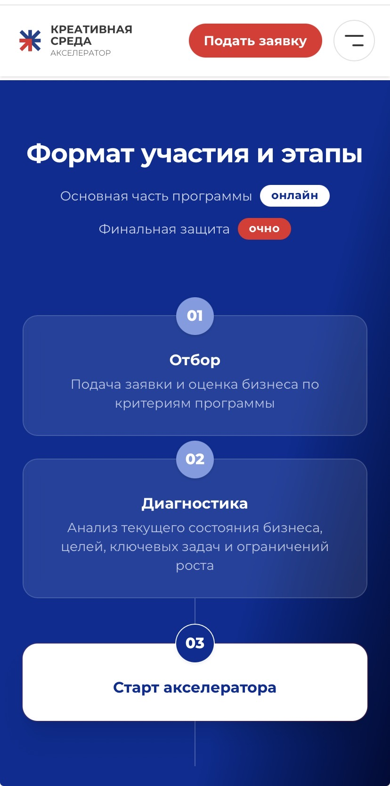

# Kreativnaya Sreda — Accelerator landing page

**English** | [Русский](README_RU.md)

Landing page for **«Креативная среда. Акселератор»** (Kreativnaya Sreda), an acceleration program for entrepreneurs in the creative industries.

🔗 **Live:** [creative-accelerator.ru](https://creative-accelerator.ru)







<p align="center">
  
  &nbsp;&nbsp;
  
</p>

## Features

- **Application form with live validation.** Errors appear once a field is left and update as the user types. Includes a phone input mask, a Cyrillic-only full name check, and a completion progress bar.
- **Adaptive form logic.** The legal address field becomes optional when a 12-digit INN (sole proprietor) is entered.
- **Form backend.** Submissions go to a Yandex Cloud Function, which writes them to Google Sheets.
- **Content in JSON.** All texts, navigation, partners and dates live in `src/data/*.json`, so content can be edited without touching components.
- **Responsive layout.** Section headings are centered on mobile and tablet and left-aligned on desktop. Partner logos scale fluidly while keeping their optical proportions.
- **Motion.** Framer Motion is used for the full-screen mobile menu and scroll reveals. Animations are kept light on purpose.
- **Legal pages.** Separate `privacy.html` and `terms.html` entry points are built alongside the landing page.

## Tech stack

React · TypeScript · Vite · Tailwind CSS · Framer Motion

## Project structure

```
public/
  assets/            images, logos, icons
  .htaccess          server config for reg.ru hosting
src/
  components/        shared UI (SectionHeading, Reveal, Logo…)
  sections/          page sections (Header, ApplicationForm, Speakers…)
  pages/             legal pages
  data/              all site content as JSON
  lib/               helpers
  main.tsx           landing entry
  legal-main.tsx     legal pages entry
index.html
privacy.html
terms.html
```

## Hosting

Static build deployed to reg.ru shared hosting over SSH.

---

© 2026 Julia Serganina. All rights reserved.
The source code is published for viewing only as part of my portfolio. Copying, running, modifying or reusing any part of it without written permission is not allowed.
